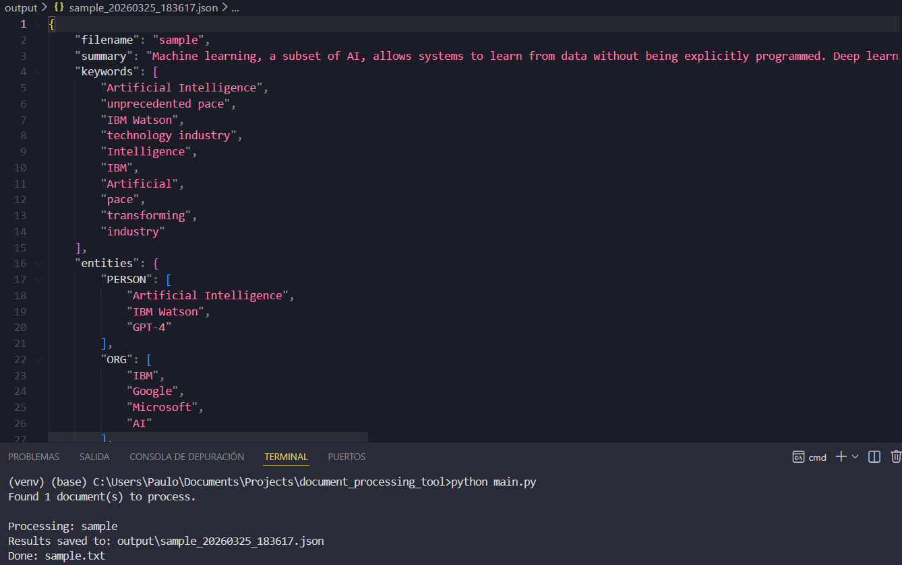

# Document Processing Tool

A Python tool that automatically extracts useful information from text documents.
Given a TXT or PDF file, it identifies key entities, extracts the most relevant 
keywords, and generates a short summary. The results are exported as a JSON file, 
ready to be used in other applications or AI pipelines.

Built to practice NLP concepts and document automation with Python.

## Key Features

- Reads TXT and PDF files from a local folder
- Extracts named entities (people, organizations, dates, etc.) using spaCy
- Identifies top keywords using the YAKE algorithm
- Generates an automatic extractive summary using LSA
- Exports all results to a structured JSON file

## Requirements

- Python 3.10+
- spaCy English model: `en_core_web_sm`

## Screenshot

